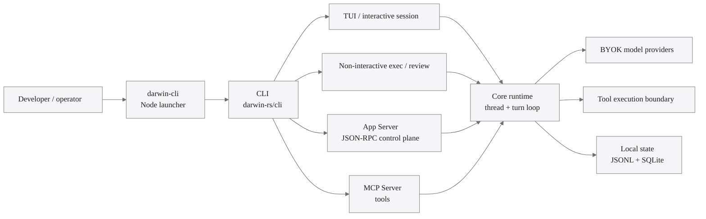
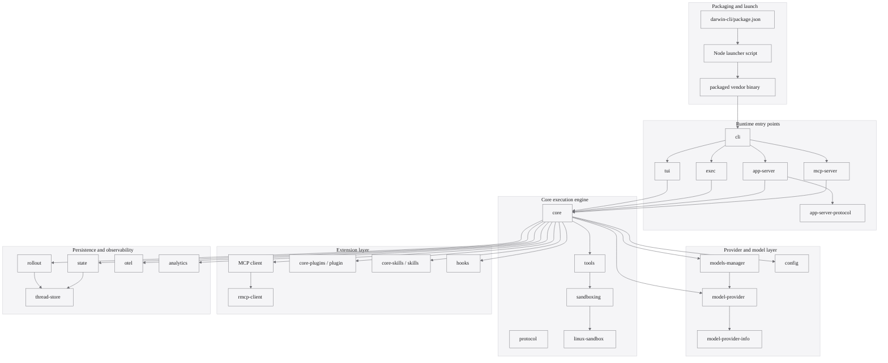
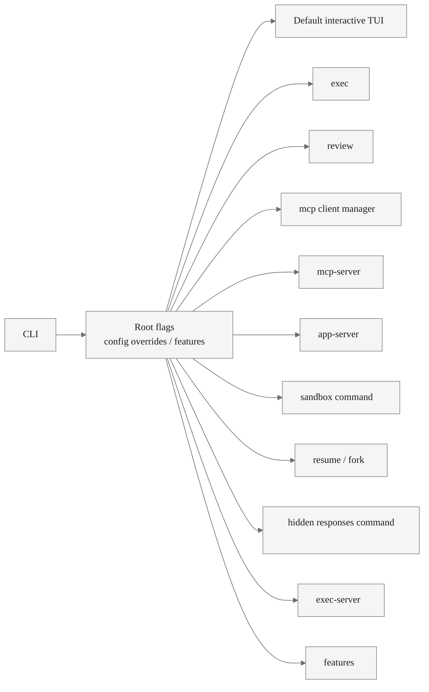
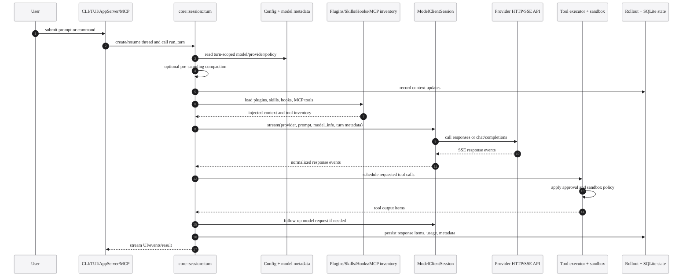
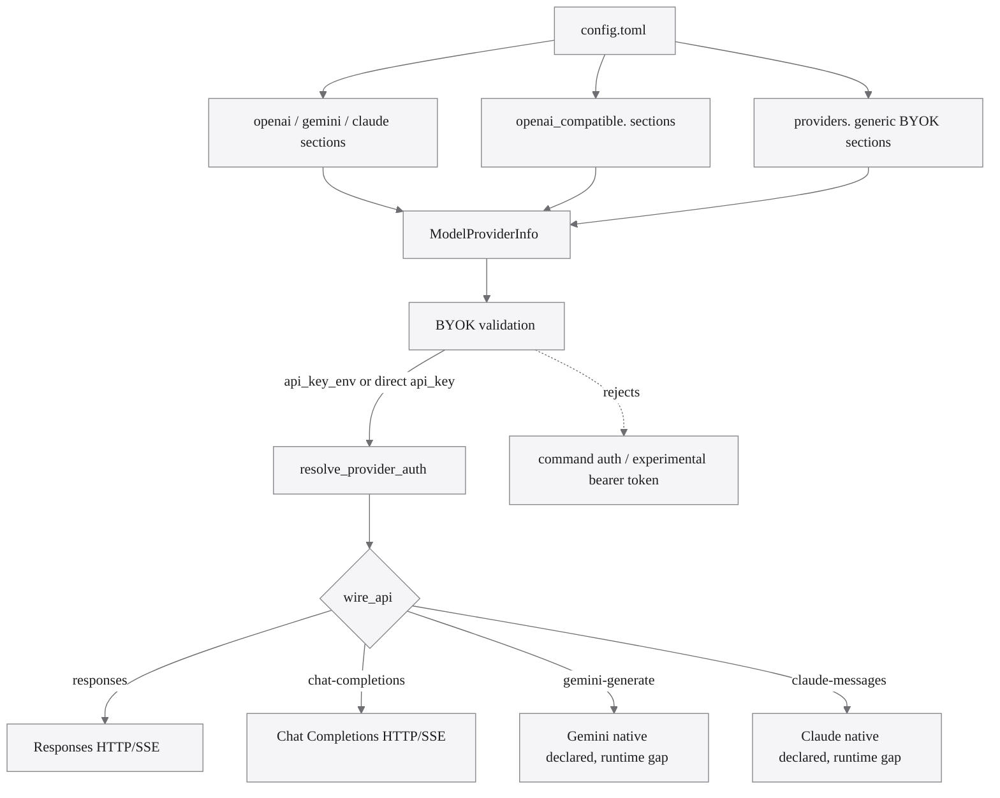
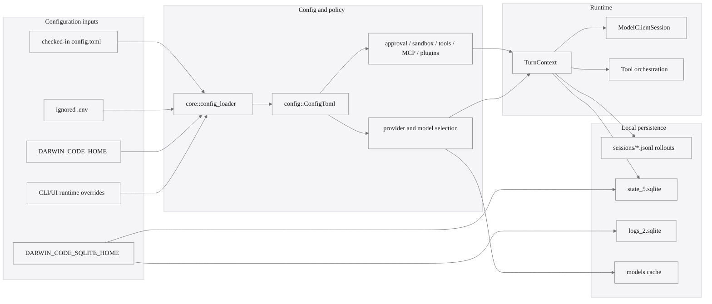
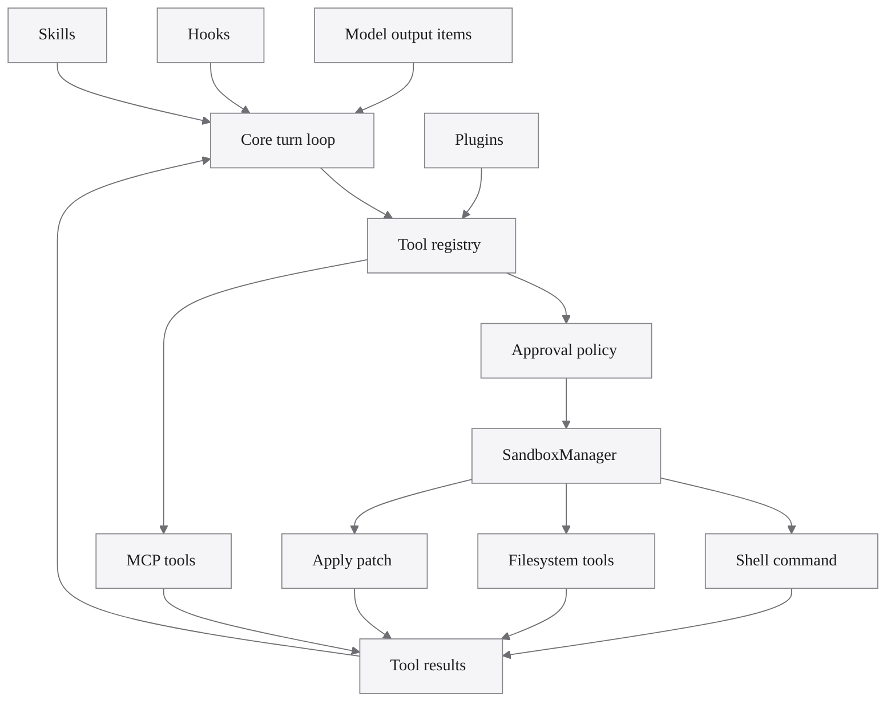
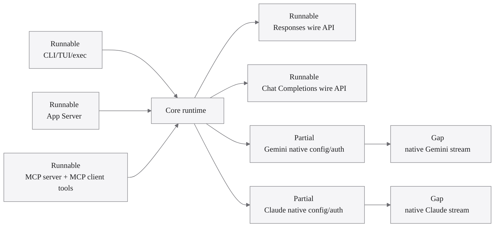

# Darwin Code Architecture Diagrams

This document is a diagram-first overview of the current Darwin Code runtime in
`70-darwin-code`. It focuses on the runnable BYOK execution engine, not on
legacy Codex hosted-account compatibility.

## 1. System context

## 2. Repository module map

## 3. CLI dispatch shape

## 4. Turn runtime lifecycle

## 5. BYOK provider routing

## 6. Config, policy, and state surfaces

## 7. Tool, extension, and sandbox boundary

## 8. Current implementation status

## Source anchors

| Area                                | Source anchors                                                                                   |
| ----------------------------------- | ------------------------------------------------------------------------------------------------ |
| Workspace member set                | `darwin-rs/Cargo.toml:1-78`                                                                      |
| Node launcher                       | `darwin-cli/bin/darwin-code.js:1-123`                                                            |
| CLI command surface                 | `darwin-rs/cli/src/main.rs:84-138`, `darwin-rs/cli/src/main.rs:600-740`                          |
| Turn loop                           | `darwin-rs/core/src/session/turn.rs:129-226`                                                     |
| Provider stream dispatch            | `darwin-rs/core/src/client.rs:664-713`                                                           |
| OpenAI-compatible provider config   | `darwin-rs/config/src/config_toml.rs:147-217`                                                    |
| Generic BYOK provider config        | `darwin-rs/config/src/config_toml.rs:255-359`                                                    |
| Wire APIs and BYOK validation       | `darwin-rs/model-provider-info/src/lib.rs:36-168`                                                |
| Provider auth headers               | `darwin-rs/model-provider/src/auth.rs:23-51`                                                     |
| App Server processor                | `darwin-rs/app-server/src/lib.rs:106-128`, `darwin-rs/app-server/src/message_processor.rs:81-93` |
| MCP server tools                    | `darwin-rs/mcp-server/src/message_processor.rs:311-350`                                          |
| Sandbox selection and transform     | `darwin-rs/sandboxing/src/manager.rs:23-87`, `darwin-rs/sandboxing/src/manager.rs:135-174`       |
| Local state and rollout persistence | `darwin-rs/state/src/lib.rs:57-63`, `darwin-rs/rollout/src/recorder.rs:68-84`                    |
